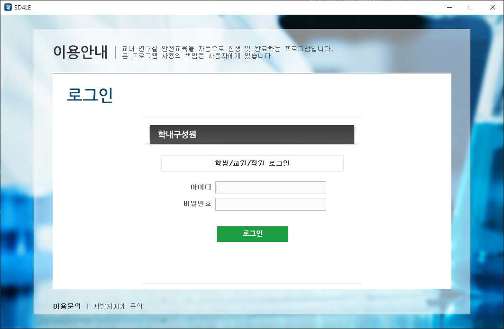
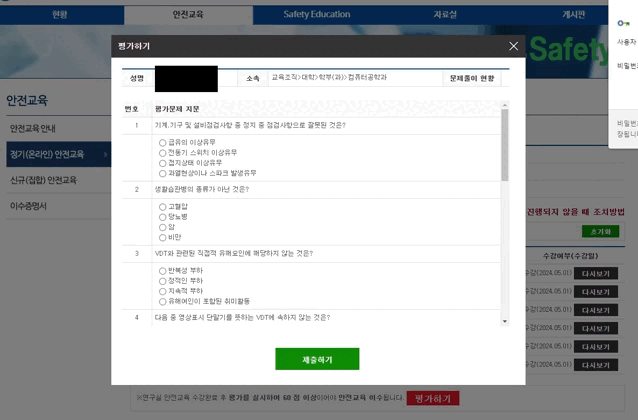
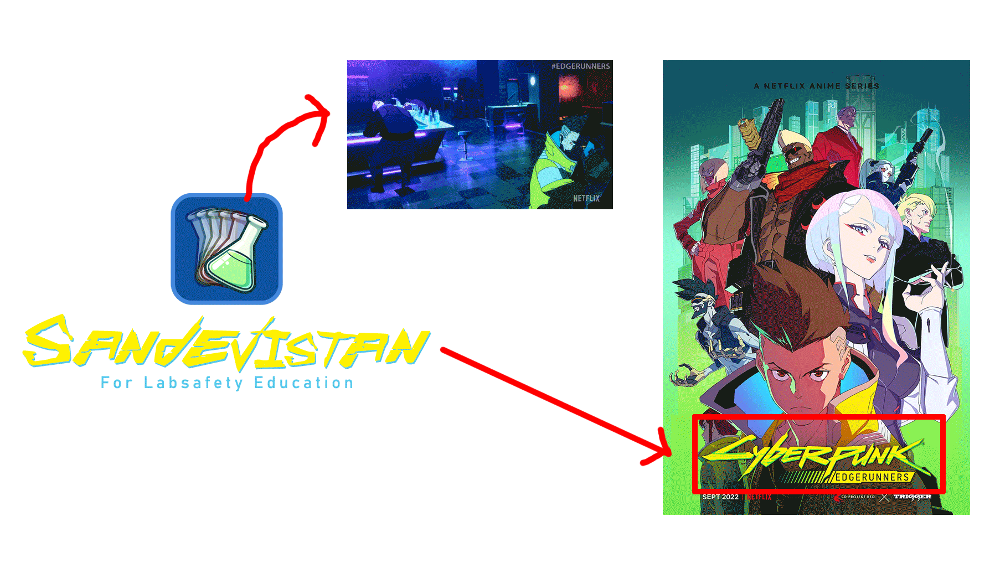

  

 

> From now on, the safety education will be over within 30 seconds.

> "A rudimentary implant."

 

## 🧭 Navigation
1. <b>[🔗 Link](#-link)</b>
2. <b>[📽 Demo](#-demo)</b>
3. <b>[🌱 Origin](#-origin)</b>

 

## 🔗 Link
- [Download](https://github.com/Yoon-men/SD4LE/releases/latest/)
- [Bug report](https://github.com/Yoon-men/SD4LE/issues)

 

## 📽 Demo

  

  

  

 

## 🌱 Origin

  

